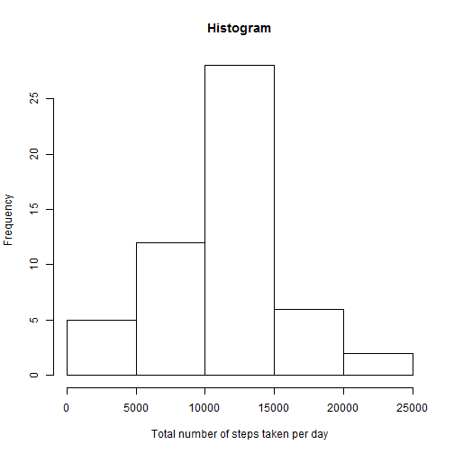
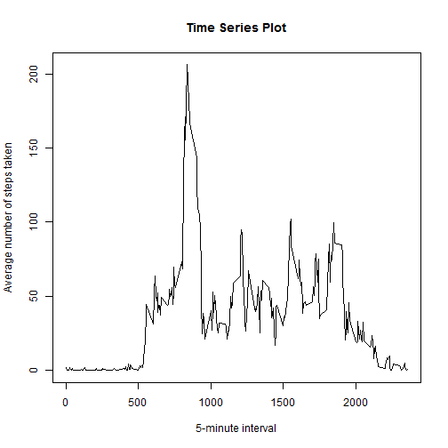
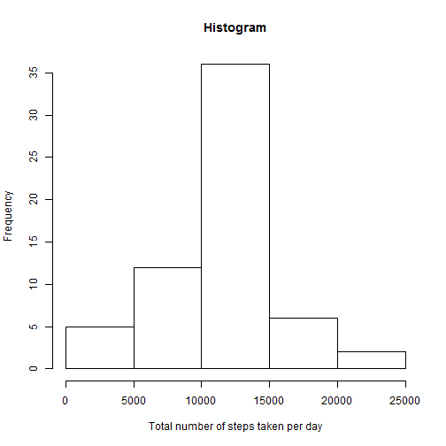
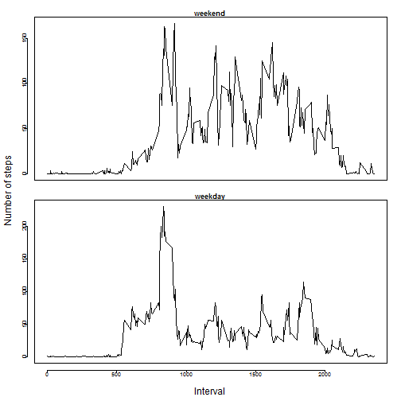

##Introduction
This assignment makes use of data from a personal activity monitoring device. This device collects data at 5 minute intervals through out the day. The data consists of two months of data from an anonymous individual collected during the months of October and November, 2012 and include the number of steps taken in 5 minute intervals each day.


##Data
The variables included in this dataset are:

**steps**: Number of steps taking in a 5-minute interval (missing values are coded as NA)

**date**: The date on which the measurement was taken in YYYY-MM-DD format

**interval**: Identifier for the 5-minute interval in which measurement was taken

There are a total of 17,568 observations in this dataset.


##Assignment
###Loading and preprocessing the data

```r
dataset <- read.csv("activity.csv")
dataset$date <- as.Date(dataset$date,"%Y-%m-%d")
```


###Ignore the missing values
Calculate the total number of steps taken per day and make a histogram of the total 
number of steps taken each day

```r
steps.total <- aggregate(steps~date, dataset, sum)
hist(steps.total$steps,main="Histogram",xlab = "Total number of steps taken per day")
```

 


Calculate the mean of the total number of steps taken per day : 10766.19

```r
steps.mean <- mean(steps.total$steps, na.rm=TRUE)
steps.mean
```

[1] 10766.19


Calculate the mean of the total number of steps taken per day : 10765

```r
steps.median <- median(steps.total$steps, na.rm=TRUE)
steps.median
```

[1] 10765


Time series plot of the average number of steps taken (averaged across all days) 
versus the 5-minute intervals

```r
steps.avg <- aggregate(steps~interval, dataset, mean)
plot(steps.avg$interval,steps.avg$steps,type="l",xlab="5-minute interval",
     ylab="Average number of steps taken",main="Time Series Plot")
```

 


"835" is the 5-minute interval, on average across all the days in the dataset, contains 
the maximum number of steps.

```r
steps.avg[which(steps.avg$steps == max(steps.avg$steps)),1]
```

[1] 835


###Deal with missing values
Calculate and report the total number of missing values in the dataset : 2304 rows

```r
num.rows <- nrow(dataset) - nrow(dataset[which(complete.cases(dataset)),])
num.rows
```

[1] 2304


Create a new dataset that is equal to the original dataset but with the missing data 
filled in by using the mean for that 5-minute interval. 

```r
data.r <- merge(dataset,steps.avg,by.x="interval",by.y="interval",all.x=TRUE)
interval.idx <- which(is.na(data.r$steps.x))
data.r[interval.idx,2] <- data.r[interval.idx,4]
data.r <- data.r[,-4]
names(data.r)[2] <- "steps"
```


Calculate the total number of steps taken per day and make a histogram of the total 
number of steps taken each day

```r
steps.t <- aggregate(steps~date, data.r, sum)
hist(steps.t$steps,main="Histogram",xlab = "Total number of steps taken per day")
```

 


Calculate the mean of the total number of steps taken per day : 10766.19

```r
steps.m <- mean(steps.t$steps)
steps.m
```

[1] 10766.19


Calculate the mean of the total number of steps taken per day : 10766.19

```r
steps.md <- median(steps.t$steps)
steps.md
```

[1] 10766.19

**After replacing missing values by using the mean for that 5-minute interval,**
**the mean of the total number of steps taken per day is the same.**
**But the median of the total number of steps taken per day seems to be impacted**
**by imputing missing data.**


###Comparing the average number of steps taken per 5-minute interval across weekdays and weekends
When 5-minute interval is greater than 1000, the number of steps during the weekends 
is much larger than during the weekdays. 

```r
library(timeDate)
data.r$week <- as.factor(ifelse(isWeekday(data.r$date),"Weekday","Weekend"))
par(mfrow=c(2,1))
steps.avg_wd <- aggregate(steps~interval,
                          data.r[which(as.character(data.r$week)=="Weekday"),], mean)
steps.avg_wk <- aggregate(steps~interval,
                          data.r[which(as.character(data.r$week)=="Weekend"),], mean)

par(mfrow = c(2, 1))
par(cex = 0.6)
par(mar = c(1.5, 1, 1.5, 1), oma = c(4, 4, 1, 1))
par(tcl = -0.25)
par(mgp = c(2, 1, 1))
plot(steps.avg_wk$interval,steps.avg_wk$steps,type="l",xaxt='n',xlab="",ylab="",main="weekend")
plot(steps.avg_wd$interval,steps.avg_wd$steps,type="l",xlab="",ylab="",main="weekday")
mtext("Number of steps", side = 2, outer = TRUE, cex = 1, line = 2.2)
mtext("Interval", side = 1, outer = TRUE, cex = 1, line = 2.2)
```

 

